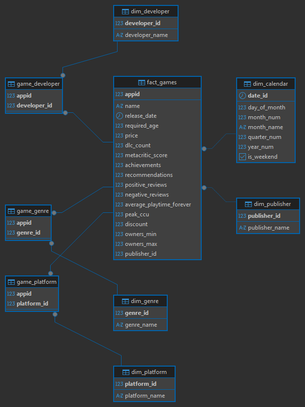

# Steam Games — Modelo Relacional y EDA en SQL

Este proyecto nace de una pregunta sencilla: ¿qué se puede aprender sobre el catálogo de Steam si lo conviertes en una base de datos relacional bien diseñada? Es el trabajo final del módulo de SQL del Máster de Data Science & IA, y el objetivo era doble: construir un modelo de datos coherente y sacarle insights de negocio reales con SQL.

Todo arranca de un único CSV descargado de Kaggle (`games_march2025_full.csv`): casi 95.000 juegos, 47 columnas, y datos completamente en bruto — géneros como listas de texto, fechas como strings, códigos especiales escondidos donde menos lo esperas. A partir de ese único archivo se ha construido todo lo demás: el modelo dimensional, la limpieza, la carga y el análisis.

## El modelo: una estrella con cinco puntas



En el centro está `fact_games`, la tabla de hechos: una fila por juego, con sus métricas — precio, reseñas, jugadores simultáneos, descuentos. Alrededor giran cinco dimensiones que dan contexto: el calendario de lanzamientos, los géneros, los desarrolladores, las distribuidoras y las plataformas.

Como un juego puede tener varios géneros a la vez, o estar disponible en varias plataformas, hicieron falta tres tablas puente (`game_genre`, `game_developer`, `game_platform`) para resolver esas relaciones de muchos a muchos. `fact_games` se conecta directamente, por FK simple, solo con `dim_calendar` y `dim_publisher` — cada juego tiene una única fecha de lanzamiento, y se decidió simplificar a un único publisher principal por juego (más abajo se explica por qué).

## Antes de empezar: descarga el dataset

El CSV original pesa más de 400 MB, así que no está incluido en este repositorio (supera el límite de GitHub). Descárgalo desde Kaggle:

🔗 [kaggle.com/datasets/artermiloff/steam-games-dataset](https://www.kaggle.com/datasets/artermiloff/steam-games-dataset)

Descarga el archivo **`games_march2025_full.csv`** (la versión sin tratar) y colócalo en `data/games_march2025_full.csv`, respetando la estructura de carpetas de abajo.

## Cómo está organizado el repositorio

```
proyecto_sql/
│
├── data/
│   └── games_march2025_full.csv      # El CSV original, tal cual viene de Kaggle
│
├── docs/
│   └── model.png                      # El diagrama de arriba
│
├── 01_schema.sql                      # Las tablas: PK, FK, constraints
├── 02_data.sql                        # Carga, limpieza, y paso a las tablas definitivas
├── 03_eda.sql                         # Vistas, función, y los análisis con sus insights
├── docker-compose.yml                 # PostgreSQL + pgAdmin
└── README.md
```

## Poniéndolo en marcha

Todo corre sobre PostgreSQL 16 en Docker, con pgAdmin como interfaz de administración por si quieres explorar la base visualmente.

**Primero, levanta los contenedores** desde la carpeta raíz:

```bash
docker-compose up -d
```

Esto te deja PostgreSQL escuchando en el puerto `5434` (usuario `postgres`, contraseña `postgres`, base de datos `steam_games`) y pgAdmin disponible en `http://localhost:8081` (usuario `admin@admin.com`, contraseña `admin`).

**Después, copia el CSV dentro del contenedor.** El `COPY` de PostgreSQL no puede leer archivos de tu máquina directamente, así que hay que pasárselo primero:

```bash
docker cp data/games_march2025_full.csv steam_games_db:/var/lib/postgresql/data/games_march2025_full.csv
```

**Y por último, ejecuta los tres scripts en orden** desde tu IDE de SQL favorito (TablePlus, DBeaver, pgAdmin...), conectando a `localhost:5434`:

1. `01_schema.sql` — construye las 9 tablas
2. `02_data.sql` — carga el CSV, lo limpia, y rellena las tablas definitivas
3. `03_eda.sql` — crea las vistas y la función, y lanza los análisis

Los tres llevan `DROP ... IF EXISTS` al principio, así que puedes ejecutarlos las veces que quieras desde cero sin que se rompa nada.

## Las decisiones que hubo que tomar por el camino

Ningún dataset real viene perfecto, y este tenía sus propias rarezas. Estas son las decisiones que marcaron el resultado final:

**Cargar primero en bruto, limpiar después.** Todo el CSV entra primero en una tabla de staging (`temp_games`) con cada columna como `TEXT`, sin excepción. Así la carga nunca falla por un tipo de dato inesperado. La conversión a tipos reales y la limpieza llegan en un segundo paso, ya con calma, al pasar los datos a las tablas definitivas.

**Quedarse con un solo publisher por juego.** Algunos juegos llegaban con varios publishers en una lista. En vez de complicar el modelo con otra tabla puente, se optó por quedarse con el primero (normalmente el principal) y mantener una FK simple. Géneros y developers sí se quedaron con todos los valores, porque ahí perder información sí dolía.

**Inventar un publisher llamado 'Unknown'.** 5.786 juegos no tenían ningún publisher asignado. Dejar la FK en NULL hubiera sido una opción, pero crear una fila `'Unknown'` en `dim_publisher` y apuntar ahí a esos juegos mantiene la integridad referencial sin fingir un dato que no existe.

**Descartar las columnas de reseñas agregadas del CSV.** `pct_pos_total` y sus parientes usaban `-1` como código para "sin reseñas suficientes" — y en algunas columnas, hasta el 92% de las filas tenían ese código. En vez de arrastrar ese ruido, se decidió no cargarlas y calcular el porcentaje de reseñas positivas directamente en el EDA, a partir de las columnas `positive_reviews` y `negative_reviews`.

**Dejar NULL como NULL, nunca como 0.** Si un publisher no tiene ninguna reseña registrada, su porcentaje de valoración aparece como NULL, no como 0%. Un cero sugeriría que a la gente no le gustó; NULL dice la verdad: simplemente no hay datos.

**Truncar los nombres más extremos.** Había nombres de juegos, publishers y developers que superaban los 200 caracteres — casos aislados, pero reales. En vez de ensanchar las columnas sin límite, se truncan con `LEFT(texto, n)` al cargar, para que un dato anómalo no tire abajo toda la inserción.

## Lo que cuentan los datos

El archivo `03_eda.sql` recoge un resumen general y nueve análisis, cada uno con su insight documentado. Si solo tuviera que elegir tres para contarlos en cinco minutos, serían estos:

**El catálogo es mayoritariamente indie, pero ser el más numeroso no significa ser el mejor valorado.** Indie domina en volumen con 63.228 juegos, muy por delante de Action o Adventure. Pero a la hora de valoraciones, queda por detrás de géneros mucho más de nicho, como las herramientas de creación de contenido.

**Los juegos gratuitos casi triplican en jugadores a los de pago.** Son solo el 20% del catálogo, pero su pico medio de jugadores simultáneos (183) casi triplica al de los juegos de pago (70). El modelo free-to-play, aunque minoritario en número, gana por goleada en actividad real.

**Pagar más no significa jugar mejor — la curva tiene forma de campana.** Ni los juegos gratis ni los que superan los 30 dólares logran las mejores valoraciones. El punto dulce está en el tramo de 5 a 15 dólares, con un 90,27% de reseñas positivas, por encima de cualquier otro rango de precio.

## Con qué se ha construido

- **Motor**: PostgreSQL 16
- **Para desarrollar**: TablePlus
- **Para el diagrama**: DBeaver
- **Para levantarlo todo**: Docker / docker-compose
